# 옷장을 부탁해 — ERD (초안)

> `docs/api-docs.json`(41개 엔드포인트, 11개 응답 DTO)을 근거로 역산한 초안이며, 팀에서 작성한 DDL 초안과 대조해 더 나은 설계를 반영했습니다(`social_accounts`/`locations` 분리, `feeds.ootds` JSONB 스냅샷, `clothes.purchase_url`, 비정규화 카운터 등). 비밀번호 초기화 토큰은 Redis로 이동해 DB 컬럼에는 없습니다. 사전기간 07/24 오전 ADR 스피드런에서 팀 전체 확인 후 확정합니다.
> 삭제/보존 전략은 `docs/conventions.md`의 [2-1. 도메인별 데이터 운영 전략]과 함께 봅니다.
> ⚠️ **아직 미해결**: `FEED.weather_id`를 FK로 걸지 스냅샷 전용으로 둘지, `CLOTHES_ATTRIBUTE`가 같은 정의(`definition_id`)에 여러 값을 허용할지(1:N) — 결정 전까지 이 문서의 기존 안(스냅샷/단일값 유니크)을 유지하고 있습니다. 아래 설계 노트 4, 13 참고.
> **팀원 리뷰 반영**: 임시 비밀번호는 Redis 토큰화(설계 노트 10), `CLOTHES_ATTRIBUTE_DEF` 선택 값은 JSONB 대신 별도 테이블로 분리(설계 노트 13), `Profile.temperature_sensitivity` NOT NULL, `User.dormant`/`last_login_at` 제거(설계 노트 1), `Notification.read_at` 제거(설계 노트 6)를 반영했습니다.

## 다이어그램

```mermaid
erDiagram
    USER ||--|| PROFILE : "1:1"
    USER ||--o{ SOCIAL_ACCOUNT : links
    USER ||--o{ CLOTHES : owns
    USER ||--o{ FEED : authors
    USER ||--o{ COMMENT : authors
    USER ||--o{ FEED_LIKE : likes
    USER ||--o{ FOLLOW : "follower"
    USER ||--o{ FOLLOW : "followee"
    USER ||--o{ DIRECT_MESSAGE : "sender"
    USER ||--o{ DIRECT_MESSAGE : "receiver"
    USER ||--o{ NOTIFICATION : receives

    CLOTHES }o--|| USER : "owner"
    CLOTHES ||--o{ CLOTHES_ATTRIBUTE : has
    CLOTHES_ATTRIBUTE_DEF ||--o{ CLOTHES_ATTRIBUTE : defines
    CLOTHES_ATTRIBUTE_DEF ||--o{ CLOTHES_ATTRIBUTE_DEF_VALUE : "선택 가능 값"

    FEED }o--|| USER : author
    FEED ||--o{ COMMENT : has
    FEED ||--o{ FEED_LIKE : has

    WEATHER ||--o{ FEED : "snapshot copied into (FK 여부 미결정, 설계 노트 4)"
    WEATHER_GRID ||--o{ WEATHER : "forecasted for"

    USER {
        uuid id PK
        string email UK
        string password "BCrypt 해싱"
        string name
        string role "USER, ADMIN"
        boolean is_locked "관리자 정지"
        string lock_reason "NONE, ADMIN_ACTION"
        instant created_at
        instant updated_at
    }

    SOCIAL_ACCOUNT {
        uuid id PK
        uuid user_id FK
        string provider "GOOGLE, KAKAO"
        string provider_id
        instant created_at
    }

    PROFILE {
        uuid user_id PK "FK to USER.id"
        string gender "MALE, FEMALE, OTHER, nullable"
        date birth_date "nullable"
        double latitude "nullable, embed(Weather와 달리 정규화 안 함 — 설계 노트 8)"
        double longitude "nullable"
        int location_x "기상청 격자 좌표, nullable"
        int location_y "기상청 격자 좌표, nullable"
        json location_names "행정구역명 배열, nullable"
        int temperature_sensitivity "1~5, not null, 기본값 3"
        string profile_image_url "nullable"
        instant created_at
        instant updated_at
    }

    CLOTHES {
        uuid id PK
        uuid owner_id FK
        string name
        string image_url "nullable"
        string purchase_url "구매링크 자동추출 심화용, nullable, 내부 전용(API 미노출)"
        string type "12종 enum"
        instant created_at
        instant updated_at
    }

    CLOTHES_ATTRIBUTE_DEF {
        uuid id PK
        string name UK
        instant created_at
        instant updated_at
    }

    CLOTHES_ATTRIBUTE_DEF_VALUE {
        uuid id PK
        uuid definition_id FK
        string value
        int sort_order "노출 순서"
        instant created_at
    }

    CLOTHES_ATTRIBUTE {
        uuid id PK
        uuid clothes_id FK
        uuid definition_id FK
        string value
        instant created_at
        instant updated_at
    }

    FEED {
        uuid id PK
        uuid author_id FK
        uuid weather_id "스냅샷 원본 참조용, 설계 노트 4"
        string sky_status "스냅샷"
        string precipitation_type "스냅샷"
        double precipitation_amount "스냅샷"
        double precipitation_probability "스냅샷"
        double temperature_current "스냅샷"
        double temperature_compared "스냅샷"
        json ootds "착장 스냅샷(OotdDto 배열 직렬화) — Clothes 삭제와 무관, 설계 노트 3"
        string content
        long like_count "비정규화 카운터, 설계 노트 11"
        int comment_count "비정규화 카운터, 설계 노트 11"
        instant created_at
        instant updated_at
    }

    FEED_LIKE {
        uuid id PK
        uuid feed_id FK
        uuid user_id FK
        instant created_at
    }

    COMMENT {
        uuid id PK
        uuid feed_id FK
        uuid author_id FK
        string content
        instant created_at
    }

    FOLLOW {
        uuid id PK
        uuid follower_id FK
        uuid followee_id FK
        instant created_at
    }

    DIRECT_MESSAGE {
        uuid id PK
        uuid sender_id FK
        uuid receiver_id FK
        string content
        instant created_at
    }

    NOTIFICATION {
        uuid id PK
        uuid receiver_id FK
        string title
        string content
        string level "INFO, WARNING, ERROR"
        instant created_at
    }

    WEATHER_GRID {
        uuid id PK
        int x "기상청 격자 좌표"
        int y "기상청 격자 좌표"
        instant created_at
    }

    WEATHER {
        uuid id PK
        uuid weather_grid_id FK
        instant forecasted_at
        instant forecast_at
        string sky_status
        string precipitation_type
        double precipitation_amount
        double precipitation_probability
        double humidity_current
        double humidity_compared
        double temperature_current
        double temperature_compared
        double temperature_min
        double temperature_max
        double wind_speed
        string wind_as_word
        instant created_at
    }

    LOCATION {
        uuid id PK
        int lat_block "위도 ~50m 단위 양자화 인덱스"
        int lon_block "경도 ~50m 단위 양자화 인덱스"
        json location_names "행정구역명 배열"
        instant created_at
    }
```

> `LOCATION`은 `WEATHER_GRID`와 관계(FK)가 없습니다 — 설계 노트 15 참고.

> `RECOMMENDATION`은 테이블이 아닙니다 — `GET /api/recommendations`는 저장된 데이터를 조회하는 게 아니라 날씨+프로필+의상 데이터를 기반으로 그때그때 계산하는 응답이라 영속 엔티티가 필요 없습니다.

## 설계 노트 (사전기간 ADR로 확정할 것)

1. **User 삭제 없음, 휴면 계정 기능은 제외** — User는 삭제 API가 없어 하드 삭제 대상이 아니지만, 팀원 리뷰로 휴면 계정 자동 전환 기능(및 `dormant`/`last_login_at` 컬럼)은 이번 범위에서 제외했습니다. 미접속 계정 처리는 범위 밖으로 둡니다 — `conventions.md` §2-1 갱신.
2. **`ClothesAttributeDef` 삭제 보호** — `CLOTHES_ATTRIBUTE`가 참조 중인 정의는 삭제 시 409 반환(FK 제약 위반을 막기 위해 서비스 레이어에서 참조 카운트 선확인).
3. **`Clothes` 삭제는 `Feed`에 영향 없음** — `FEED.ootds`는 게시 시점의 착장을 JSONB로 스냅샷 저장합니다(라이브 조인이 아님). 그래서 사용자가 나중에 `Clothes`를 삭제해도 이미 올라간 피드의 착장 표시는 그대로 유지되고, 별도 cascade 처리가 필요 없습니다. `FeedCreateRequest.clothesIds`를 받아 서버가 `Clothes`를 조회해 `OotdDto[]`로 직렬화한 뒤 저장합니다.
4. **`Feed`의 `Weather` 참조 방식 — 미결정** ⚠️ `FeedDto.weather`가 `WeatherSummaryDto`(축소된 필드)로 내려가는 건 스냅샷 컬럼(`sky_status` 등)이 있기 때문인데, `weather_id`를 실제 FK 제약으로 걸면 날씨 retention 배치(7일 경과분 삭제, 수행계획서 2차 스프린트)가 피드 참조 중인 행을 못 지웁니다. FK 제약을 걸지 않거나(스냅샷만 신뢰), retention 배치가 "피드 미참조 행만" 지우도록 제한하거나 — 팀 결정 필요.
5. **`Comment` 수정/삭제 API가 스펙에 없음** — 현재는 등록/조회만 가능. 이대로 갈지, 스펙 누락인지 사전기간에 팀/멘토 확인 필요. 확인 전까지는 Comment에 별도 삭제 관련 컬럼(soft-delete 등) 추가하지 않음.
6. **`Notification`은 하드 삭제로 확정** — `read_at` 컬럼을 제거하고, `DELETE /api/notifications/{id}`는 소프트 읽음 처리가 아니라 실제 물리 삭제로 확정합니다. 읽음 후 N일 경과분만 배치로 정리하던 정책도 함께 폐기됩니다 — `conventions.md` §2-1 갱신.
7. **`Follow`/`FeedLike`/`ClothesAttribute`는 복합 유니크 제약** — `(follower_id, followee_id)`, `(feed_id, user_id)`, `(clothes_id, definition_id)` 각각 UNIQUE로 중복 팔로우/중복 좋아요/중복 속성 부여 방지(API 레벨 검증과 이중 방어).
8. **위치 값 객체는 도메인별로 다르게 처리** — `Profile`은 유저당 1개뿐이라 `latitude`/`longitude`/`x`/`y`/`location_names`를 자체 컬럼으로 embed. `Weather`는 같은 좌표의 예보가 반복 생성되므로 `WEATHER_GRID` 테이블로 정규화하고 `weather_grid_id` FK로 참조 — 중복 저장 방지, 격자 기준 조회 인덱스(`(x, y)`)도 `WEATHER_GRID` 하나에만 걸면 됨. `WEATHER_GRID`는 이 목적 하나만 담당하므로 `latitude`/`longitude`/`location_names`를 두지 않음(설계 노트 15에서 분리).
9. **소셜 로그인은 `SOCIAL_ACCOUNT` 테이블로 관리** — `UserDto.linkedOAuthProviders`(FE 계약에는 있으나 `api-docs.json` 스키마엔 없는 필드, 수행계획서 [알려진 계약 차이] 참고)는 `User`에 배열 컬럼을 두는 대신, `SOCIAL_ACCOUNT WHERE user_id = ?`를 조회해 응답 생성 시점에 파생시킵니다. `UNIQUE(provider, provider_id)`로 동일 소셜 계정이 다른 유저에 중복 연동되는 것도 방지.
10. **비밀번호 초기화는 Redis 토큰화로 변경** — `User.temp_password`/`temp_password_expires_at` 컬럼을 제거하고, `POST /api/auth/reset-password` 시 Redis에 `password-reset:{token}` 키로 `userId`를 저장하고 TTL(예: 30분)로 만료를 관리합니다. 로그인 시 임시 비밀번호 검증 로직도 제거되고, 토큰 기반 비밀번호 재설정 흐름으로 대체됩니다.
11. **`Feed.like_count`/`comment_count`는 비정규화 카운터** — 매번 `COUNT(*)` 하지 않고 컬럼에 캐싱합니다. 좋아요/댓글 생성·삭제 시 반드시 같은 트랜잭션 안에서 원자적으로 증감(`UPDATE ... SET like_count = like_count + 1`)해야 카운트가 실제 값과 어긋나지 않습니다.
12. **DB 제약/인덱스 네이밍 규칙** — `PK_{TABLE}`, `FK_{참조테이블}_TO_{현재테이블}_{순번}`, `CHK_{table}_{column}`, `UQ_{table}_{columns}`, `IDX_{table}_{columns}` 형식으로 통일합니다(`conventions.md` §2-2 참고).
13. **`CLOTHES_ATTRIBUTE_DEF`의 선택 가능 값은 JSONB 대신 별도 테이블로 분리** — `selectable_values` JSON 배열 컬럼을 없애고 `CLOTHES_ATTRIBUTE_DEF_VALUE`(값 1개당 1행)로 분리합니다. 값 추가/삭제/순서 변경이 UPDATE 없이 행 단위로 가능해지고, 특정 값이 실제 사용 중인지도 SQL로 바로 확인할 수 있습니다.
14. **`CLOTHES_ATTRIBUTE`의 정의당 다중 값 허용 여부 — 미결정** ⚠️ 현재는 `(clothes_id, definition_id)` UNIQUE로 정의당 값 1개만 허용하지만, 색상처럼 다중 값이 자연스러운 속성도 있어 1:N 허용 여부를 팀 결정 필요. 허용하기로 하면 유니크 제약을 `(clothes_id, definition_id, value)`로 변경.
15. **격자(`WEATHER_GRID`)와 실제 위치(`LOCATION`)를 완전히 분리 캐싱** — 기상청 격자는 5km 단위라 하나의 격자에 여러 행정동(많게는 4개 자치구, 최대 28개 동)이 걸칠 수 있어, 격자 기준으로 캐싱한 행정구역명을 응답에 그대로 쓰면 같은 격자를 공유하는 다른 위치의 사용자에게 엉뚱한 행정구역명이 내려갑니다. 그래서 원래 `locations` 테이블이던 것을 `weather_grids`로 리네임하고 `x`/`y`만 남긴 순수 격자 식별 테이블로 정리했고(날씨 FK 대상, 카카오 호출 없음), 응답용 행정구역명은 위경도를 양자화한 별도 `locations` 테이블(구 `location_blocks`)에서 조회/캐싱합니다 — `WEATHER`/`WEATHER_GRID`와는 FK 관계가 없는 독립 캐시 테이블입니다. `GET /api/weathers` 응답의 `latitude`/`longitude`는 어느 테이블 값도 아니라 요청 좌표를 그대로 반환합니다.

    양자화 블록 크기는 초기 50m에서 500m로 재조정했습니다(PR #27 리뷰 지적 — "행정동 이름" 캐시 목적에 비해 50m는 지나치게 촘촘해 행정동 하나가 수천~수만 개 블록으로 쪼개지고, 60m만 이동해도 캐시 미스로 카카오 호출이 늘어남). 실사용 트래픽이 없어 히트율을 실측할 수 없으므로 행정동 평균 면적으로 역산했습니다 — 서울 기준 605km² / 424개 행정동 ≈ 평균 1.4km²(한 변 약 1.2km). 50m 블록이면 (1,400m/50m)² ≈ 784개 블록/행정동, 500m 블록이면 (1,400m/500m)² ≈ 7.8개 블록/행정동으로 같은 행정동 내 캐시 공유가 실질적으로 생기고, 블록 한 변(500m)이 행정동 한 변(~1.2km)의 40% 수준이라 행정동 경계에 걸쳐 다른 행정동명이 캐시될 위험도 과도하게 커지지 않습니다. `block-size-meters`는 하드코딩 상수가 아니라 `weather.location-block.block-size-meters` 설정값(`LocationBlockProperties`)으로 뺐습니다 — 배포 환경별 조정, 후속 실측 재조정 여지를 남기기 위함입니다. `locations`는 TTL 없이 `(lat_block, lon_block)` UNIQUE로만 캐싱되므로, 블록 크기 변경 시 마이그레이션 없이 새 블록 키로 자연스럽게 캐시 미스가 나 재적재됩니다(현재 기준에서는 실제 운용 DB가 존재한 적이 없어 기존 50m 기준 행 자체가 없고, 정리 대상도 아닙니다).
